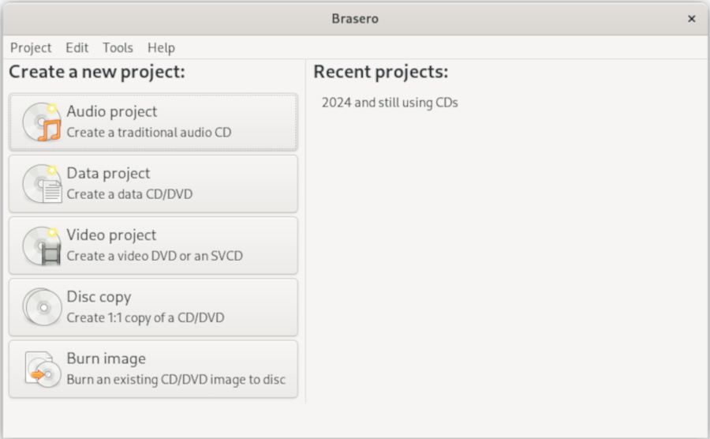
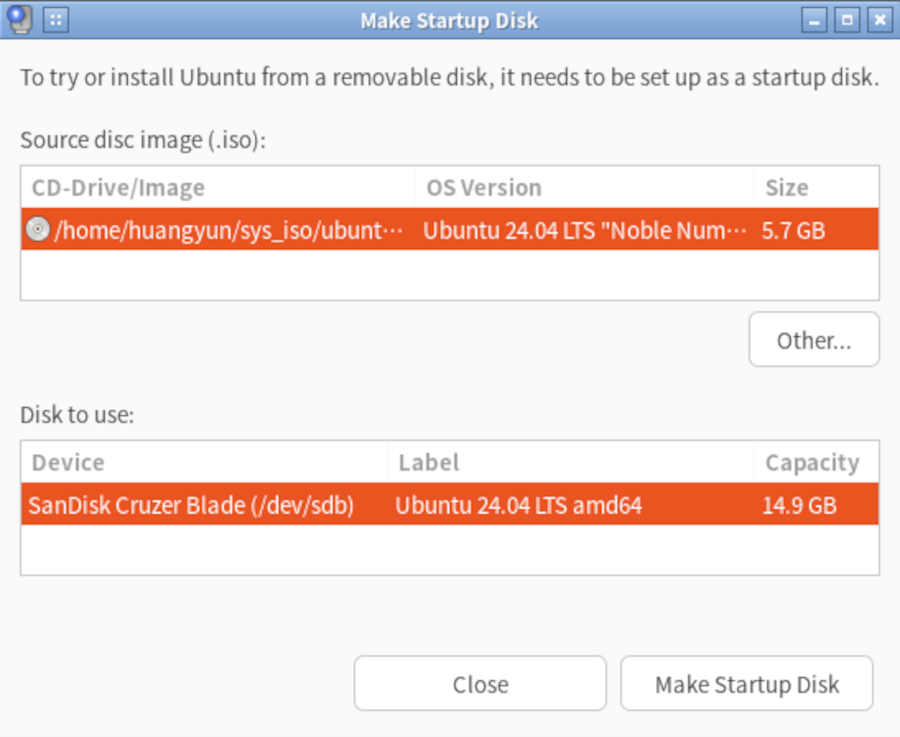
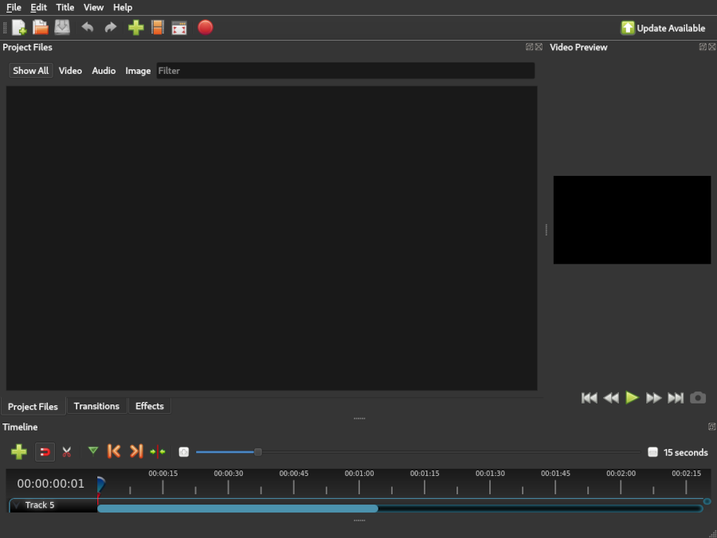

# 2024-04-01 Ubuntu常用软件列表

### 光盘刻录软件 `brasero`



**简介**：

Brasero 是 Gnome 桌面环境中一款功能强大且使用简便的光盘刻录软件，支持数据光盘刻录、转录CD音频、复制CD/DVD等。

**网址**：

[https://wiki.gnome.org/Apps/Brasero](https://wiki.gnome.org/Apps/Brasero)

**安装**：

```bash
sudo apt install brasero
```

### Ubuntu 系统启动U盘制作软件 `usb-creator-gtk`



**简介**：

现代台式机和笔记本上已经很少还带光盘驱动器，较为常见的外部存储接口是 USB 接口。
如果想从官方下载的 Ubuntu ISO 文件制作 USB 启动盘，可以用 Ubuntu 自带的图形化工具 `usb-creator-gtk`。

**网址**：

[https://manpages.ubuntu.com/manpages/noble/man8/usb-creator-gtk.8.html](https://manpages.ubuntu.com/manpages/noble/man8/usb-creator-gtk.8.html)

**安装**：

```bash
sudo apt install usb-creator-gtk
```

**启动**：

注意修改 USB 盘需要 `root` 权限，所以使用 `sudo` 启动。

```bash
sudo usb-creator-gtk
```

### 视频编辑软件 OpenShot



**简介**：

OpenShot Video Editor 是一款适用于 Windows、macOS、Linux 和 ChromeOS 的免费开源视频编辑器。
 
**网址**：

[https://www.openshot.org/](https://www.openshot.org/)

**安装**：

```bash
sudo apt install openshot-qt
```

也可以从官方下载最新的版本。

**启动**：

```bash
openshot-qt
```

### 挂载苹果设备 `ifuse`

**简介**：

可以用 `ifuse` 挂载 iPhone 和 iPad 。

**安装**：

```bash
sudo apt install ifuse
```

**挂载**:

```bash
ifuse /path/to/mount/point
```

### 挂载安卓设备 `jmtpfs`

**简介**：
可以用 `jmtpfs` 挂载安卓系统手机。

**安装**：

```bash
sudo apt install jmtpfs
```

**挂载**：

```bash
jmtpfs /path/to/mount/point
```

