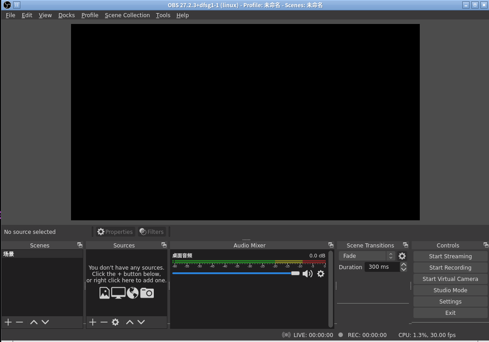

# 2024-04-01 Ubuntu常用软件列表

## 光盘刻录软件 `brasero`


**简介**：

Brasero 是 Gnome 桌面环境中一款功能强大且使用简便的光盘刻录软件，
支持数据光盘刻录、转录CD音频、复制CD/DVD等。

**网址**：

[https://wiki.gnome.org/Apps/Brasero](https://wiki.gnome.org/Apps/Brasero)

**安装**：

```bash
sudo apt install brasero
```

## Ubuntu 系统启动U盘制作软件 `usb-creator-gtk`


**简介**：

现代台式机和笔记本上已经很少还带光盘驱动器，较为常见的
外部存储接口是 USB 接口。
如果想从官方下载的 Ubuntu ISO 文件制作 USB 启动盘，
可以用 Ubuntu 自带的图形化工具 `usb-creator-gtk`。

**网址**：

[https://manpages.ubuntu.com/manpages/noble/man8/usb-creator-gtk.8.html](https://manpages.ubuntu.com/manpages/noble/man8/usb-creator-gtk.8.html)

**安装**：

```bash
sudo apt install usb-creator-gtk
```

**启动**：

注意修改 USB 盘需要 `root` 权限，所以使用 `sudo` 启动。

```bash
sudo usb-creator-gtk
```

## 视频编辑软件 OpenShot


**简介**：

OpenShot Video Editor 是一款适用于 Windows、MacOS、Linux 和 ChromeOS 的
免费开源视频编辑器。

**网址**：

[https://www.openshot.org/](https://www.openshot.org/)

**安装**：

```bash
sudo apt install openshot-qt
```

也可以从官方下载最新的版本。

**启动**：

```bash
openshot-qt
```

## 录屏直播软件 OBS Studio



**简介**：

OBS (Open Broadcaster Software) 是一款适用于 Windows、MacOS、Linux 的
免费开源录屏直播软件，支持YouTube、Twitch等常用直播平台的直播。

**网址**：

[https://obsproject.com/](https://obsproject.com/)

**安装**：

```bash
sudo add-apt-repository ppa:obsproject/obs-studio
sudo apt update
sudo apt install ffmpeg obs-studio
```

也可以从官方下载最新的版本。

**启动**：

```bash
obs
```

## 命令行加密解密工具 `gnupg`

**简介**：

如果有一些私密文件（如 SSH 的密钥文件）想复制到其他机器上，
但又不想传输明文（例如通过邮件发送），
那么可以用命令行下的加密工具进行加密后再传输。

[GNU Privacy Guard (GnuPG)](https://gnupg.org/) 是一款简单易用的加密工具，可以保证数据安全。

**安装**：

```bash
sudo apt install gnupg
```

**加密**：

假设需要加密的明文文件是 `foo.txt`，那么下面的命令可以进行加密。

```bash
gpg --no-symkey-cache -c foo.txt
```

运行之后会提示输入加密密码，加密成功后会生成加密之后的文件 `foo.txt.gpg`。
命令中的 `--no-symkey-cache` 参数是不让 `gpg` 缓存输入的密码，否则在同一台机器上解密的时候，有可能会使用之前缓存的密码，而并非提示用户输入解密密码。

**解密**：

```bash
gpg -d foo.txt.gpg -o bar.txt
```

运行之后会提示解密密码，解密成功之后文件内容会写到 `bar.txt` 中。
默认 `gpg` 解密文件内容会输出到屏幕，可以用 `-o|--output` 来指定输出文件。

## 挂载苹果设备 `ifuse`

**简介**：

可以用 `ifuse` 挂载 iPhone 和 iPad 。

**安装**：

```bash
sudo apt install ifuse
```

**挂载**:

```bash
ifuse /path/to/mount/point
```

## 挂载安卓设备 `jmtpfs`

**简介**：
可以用 `jmtpfs` 挂载安卓系统手机。

**安装**：

```bash
sudo apt install jmtpfs
```

**挂载**：

```bash
jmtpfs /path/to/mount/point
```
